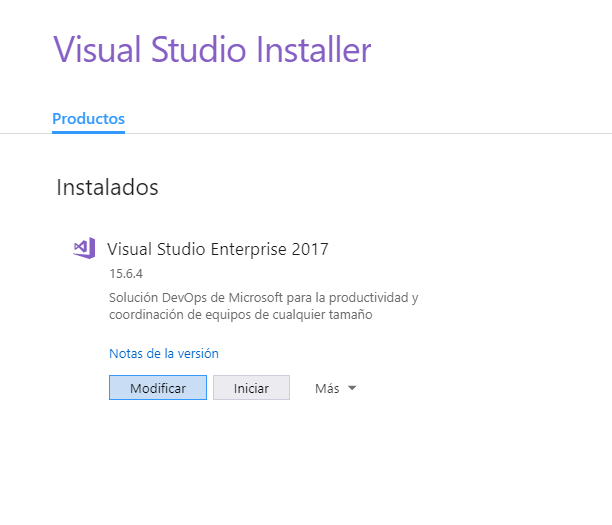
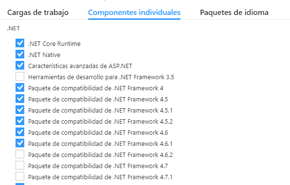
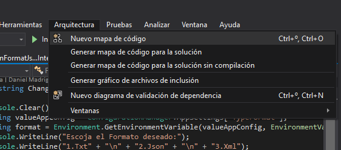
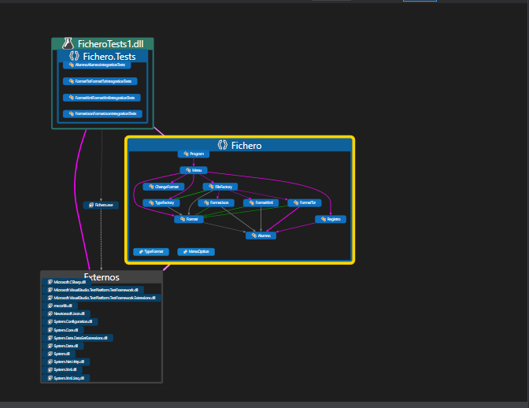

# Como instalar herramientas de Arquitectura de Software (UML) en Visual Studio Enterprise

Si ya os habéis instalado la versión Enterprise con los bloques que Jordi nos comento , teneis que acceder de nuevo al instalador de visual studio:

* Hacemos Clic en modificar:

* Entramos en la sección de componentes individuales:

* Buscamos la sección de Herramientas de Código y seleccionamos todos los campos:

* Una vez seleccionados el instalador los agrega y nos aparecerá la opción de Arquitectura
dentro de Visual Studio:

* Nos genera el mapa de código:

