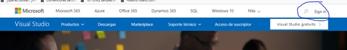
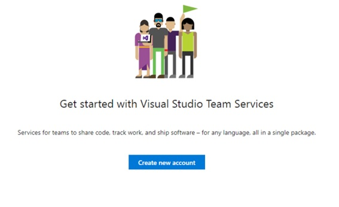
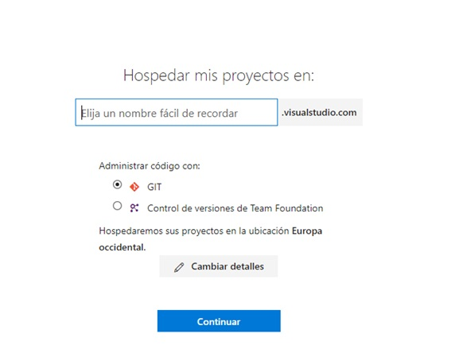
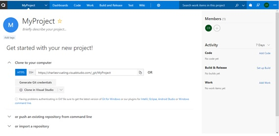

## Tutorial de VSTS

#### Introducción:

Esto es un tutorial para entener como funciona la herramiento online de VSTS (Visual Studio Team Server).
Esta herramienta es gratuita (hay funciones que son de pago) pero para poder utilizarla necesitamos una cuenta de microsoft (hotmail, outlook...).

#### Tutorial:

Para acceder a VSTS podemos acceder desde la página de [visualstudio](www.visualstudio.com), accedemos con nuestra cuenta de microsoft y nos aparecera la home del VSTS.

Una vez aquí debemos crear una nueva cuenta de VSTS, que al final vendrian a ser como un dominio donde tendremos todos nuestos repositorios (que hablando en VSTS son los proyectos).
Lo primero que nos pedira el nombre del subdominio (ya que el ominio principal seria visualstudio.com) y te despues nos pedirá si el formato de los repositorios son GIT o TFS.
NOTA: esto es solo la configuración para el primer proyecto que se creará de forma automática, también tenemos más opciones de configuración en e boton de "Cambiar Detalles".

Una vez que se cree el primer proyecto veremos una vista muy parecida a la de github donde tenemos:

1. Dashboards: Es una vista en cajas personalizable para tener todas las confguraciones / características del VSTS de un vistazo.

2. Code: aquí tenemos todo lo relacionado con el Repositorio en si:
    * Files: Veriamos los archivos que contiene el Repo.
    * Commits: Veriamos los commits hechos en el repo.
    * Pushes: Tendriamos toda la relación de Pushes del repo.
    * Branches: Podemos ver las branches creadas sobre el repo.
    * Tags: Lo mismo para las tags del repo.
    * Pull request: Vista oara os pull request del repo seleccionado.

3. Work: Tenemos toda la relacion de Tasks (llamemosles Tasks o Tickets).
    * Work Items: Son las Issues en VSTS.
    * Backlogs: Son los tickets creados de base que no estan asignados ni a versión ni a personas.

4. Build and release: Configuraciones y visualizaciones de compialciones y entornos

5. Test: Configuraciones y visualizaciones de Test, plan test, resultados.

